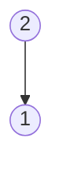
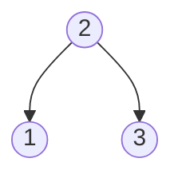
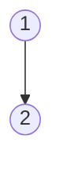
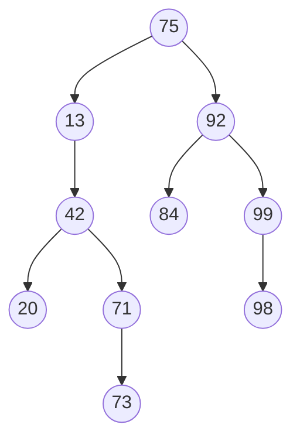
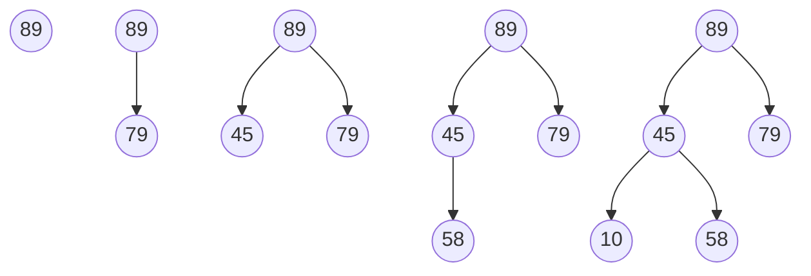
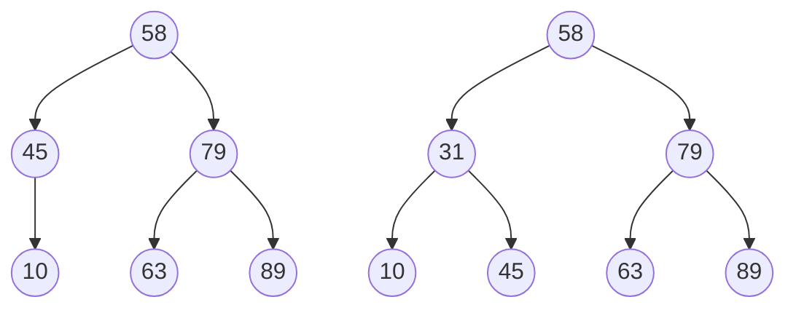

# Chapter 16

罗海旻 U201514716

## Checkpoint 0

- Insert the keys 1,2 and 3 in the order 2, 1, 3 and draw the tree formed. Then insert the keys in the order 1,2,3. What do you notice?

1. 以1,2,3顺序插入






2. 以1,2,3顺序插入





​	由上述可知，不同顺序插入树中，数的形状可能不同。

## Checkpoint 1

- Write a function elem bst_max(bst B) that returns the element with the maximum key in a given BST.

```c#
tree* bst_max_helper(tree *T)
//@requires is_ordtree(T);
//@requires T != NULL;
//@ensures \result->right == NULL;
{
  if (T->right == NULL) return T;
  else return bst_max_helper(T->right);
}

elem bst_max(bst B)
//@requires B != NULL;
{
  if (B->root == NULL) return NULL;
  return bst_max_helper(B->root)->data;
}
```

- Write a function int count_leaves(bst B) that counts the number of leaves in a given BST.

```c#
int count_leaves_helper(tree* T)
//@requires \result > 0 || T==NULL;
{
  if (T==NULL) return 0;
  if (T->left==NULL && T->right==NULL) return 1;
  //@assert T->left != NULL || T->right != NULL;
  return count_leaves_helper(T->left) + count_leaves_helper(T->right);
}
```








